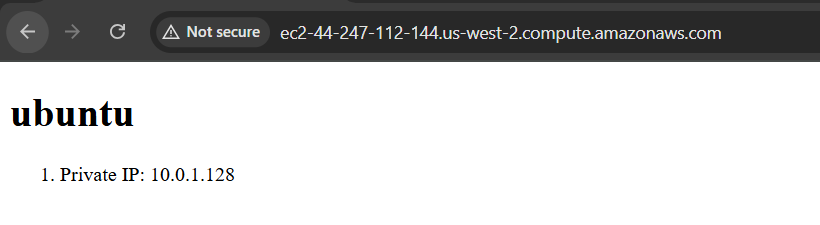

# 4640-w11-lab-start-w25



1) Import lab key

```
./import_lab_key ~/.ssh/aws.pub
```

2) Terraform
```
terraform init to install plugins

terraform fmt/validate to check config
# cannot use validate for specific file, will scan all files in current directory

terraform plan -out <plan-name>

terraform apply <plan-name>
```
3) Ansible

```
ansible-playbook playbook.yml
```